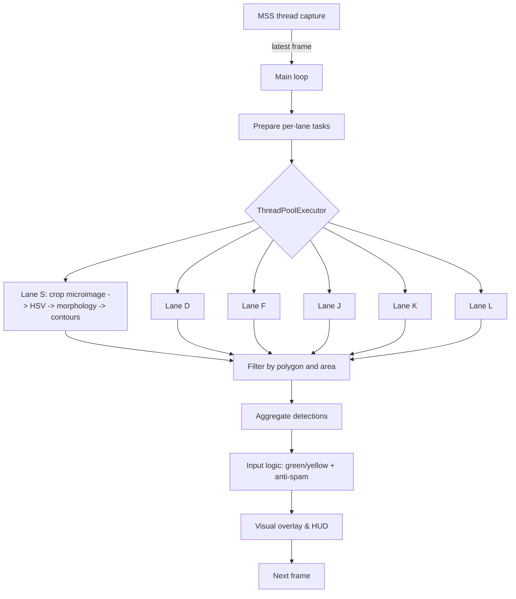
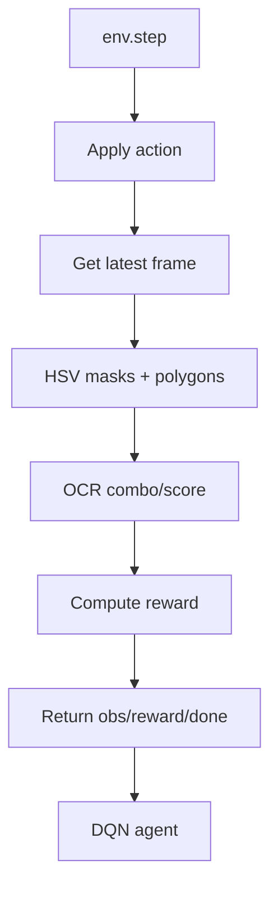

# 🎸 Guitar-villAIn

[](https://www.python.org/downloads/)
[](https://opencv.org/)
[](https://opensource.org/licenses/MIT)

Personal research project exploring two independent approaches to automate key presses in Guitar Hero-like games using Computer Vision and, experimentally, Reinforcement Learning. The goal is to learn and experiment with real-time vision and system design.

## 🎯 Independent approaches

### 1) Color/Polygon Approach (`color_pattern_approach/`)
- **Idea**: Detect notes by HSV color inside lane polygons and simulate key presses.
- **Tech**: OpenCV, NumPy, MSS/PyAutoGUI, pydirectinput.
- **Design**: Dedicated capture thread, per-lane processing, anti-spam input logic.

### 2) Reinforcement Learning Approach (`reinforcement_ai_approach/`)
- **Idea**: A DQN agent learns to play from vision-based observations.
- **Tech**: Gymnasium, PyTorch (DQN/Dueling/Double), OpenCV.
- **Design**: `GuitarHeroEnv` environment, `DQNAgent` agent, threaded capture, combo/score OCR.

Both approaches are **completely independent** and represent different learning paths for the same problem.

## ✨ Key technologies

This project explores:

- **Vision**: OpenCV (HSV, morphology, contours, polygon masking).
- **Input**: `pydirectinput` to simulate keys on Windows.
- **Capture**: `mss` (preferred) and `pyautogui` (fallback) in a dedicated thread.
- **RL**: PyTorch, Gymnasium, DQN/Dueling/Double, Prioritized Replay (experimental).
- **OCR**: Tesseract via `pytesseract` for combo/score (RL approach).

## 🛠️ Project structure

```
Guitar-villAIn/
├── 📂 color_pattern_approach/          # Approach de detección por color
│   ├── color_pattern_visualizer.py
│   ├── screen_capture.py
│   ├── config_manager.py
│   ├── metrics.py
│   ├── config.ini
│   └── requirements.txt
├── 📂 reinforcement_ai_approach/       # Approach de Reinforcement Learning
│   ├── 📂 src/
│   │   ├── 📂 ai/
│   │   │   ├── dqn_agent.py
│   │   │   └── env.py
│   │   ├── 📂 core/
│   │   │   ├── screen_capture.py
│   │   │   ├── score_detector.py
│   │   │   └── combo_detector.py
│   │   └── 📂 utils/
│   │       ├── config_manager.py
│   │       ├── helpers.py
│   │       └── logger.py
│   ├── 📂 utils/
│   │   ├── polygon_visualizer.py
│   │   ├── setup_wizard.py
│   │   └── static_hsv_calibrator_plus.py
│   ├── 📂 config/
│   │   └── config.ini
│   ├── input_preview.py
│   ├── train.py
│   └── requirements.txt
├── 🔧 launch_*.py                     # Scripts launcher
├── 📋 requirements.txt               # Dependencias principales
├── 📂 logs/                          # Logs del sistema
└── 📖 README.md                      # Documentación
```

## 🚀 Instalación y Uso

### Requisitos
- Python 3.11+
- Windows 10/11 (requiere privilegios de administrador para simular teclas)
- Guitar Hero ejecutándose en modo ventana

### Instalación Rápida
```powershell
# Desde la raíz del proyecto
pip install -r requirements.txt
```

### Ejecutar

**Configurar Regiones de Captura:**
```bash
python launch_setup_wizard.py
```

**Color/Polygon Approach:**
```bash
python launch_color_pattern.py
```

**Reinforcement Learning Approach:**
```bash
python launch_input_preview.py
python reinforcement_ai_approach/train.py
```

### Scripts Launcher
Los launchers permiten ejecutar desde cualquier directorio:
- `launch_setup_wizard.py` - Configuración visual de regiones
- `launch_input_preview.py` - Preview del approach de RL
- `launch_color_pattern.py` - Visualizer del approach de color

## 🧭 Process diagrams

### Color/Polygon (a.k.a. Sloth) approach – per frame


Notes:
- Each lane is processed independently in parallel.
- For green notes, yellow processing can be skipped within the same lane.
- Input logic applies cooldowns and controlled randomness.

### Reinforcement Learning approach – per step


## 📂 Project Structure

```
Guitar-villAIn/
├── color_pattern_approach/          # Computer Vision Research
│   ├── color_pattern_visualizer.py  # Main detection experiment
│   ├── config_manager.py           # Configuration system
│   ├── screen_capture.py           # Optimized capture system
│   ├── config.ini                  # Experiment parameters
│   ├── requirements.txt            # Dependencies
│   └── README.md                   # Research documentation
│
├── reinforcement_ai_approach/       # AI Research
│   ├── src/
│   │   ├── ai/
│   │   │   ├── dqn_agent.py        # Deep Q-Network implementation
│   │   │   └── env.py              # Gymnasium environment
│   │   ├── core/
│   │   │   ├── combo_detector.py   # OCR-based combo detection
│   │   │   ├── score_detector.py   # Score detection system
│   │   │   └── screen_capture.py   # Screen capture for AI
│   │   └── utils/
│   │       ├── config_manager.py   # Configuration management
│   │       ├── helpers.py          # Utility functions
│   │       └── logger.py           # Logging system
│   ├── utils/
│   │   ├── polygon_visualizer.py   # Detection visualization
│   │   └── static_hsv_calibrator_plus.py # HSV calibration
│   ├── config/
│   │   └── config.ini              # AI experiment parameters
│   ├── train.py                    # Training experiment
│   ├── combo_calibrator.py         # Calibration tool
│   ├── requirements.txt            # AI dependencies
│   └── README.md                   # AI research documentation
│
├── lanzar_color_pattern.bat        # Quick start script
└── README.md                       # This overview
```

## 🔧 Configuration
- Each approach has its own `config.ini` defining capture, lane polygons, HSV ranges and auxiliary parameters.
- The RL approach additionally defines agent hyperparameters and OCR regions.

## 🛠️ Herramientas

**Scripts Launcher (Ejecutar desde cualquier directorio):**
- `launch_setup_wizard.py` - Configuración visual de regiones de captura
- `launch_input_preview.py` - Preview del approach de Reinforcement Learning
- `launch_color_pattern.py` - Visualizer del approach de Color Pattern

**Herramientas de Debug:**
- `polygon_visualizer.py` - Visualizar polígonos de detección
- `static_hsv_calibrator_plus.py` - Calibrar rangos HSV
- `combo_calibrator.py` - Calibrar detección de combos

## 🧪 Inicio Rápido

**Configuración Inicial (Obligatorio):**
```bash
python launch_setup_wizard.py
```

**Color/Polygon Approach:**
```bash
python launch_color_pattern.py
```

**Reinforcement Learning (Experimental):**
```bash
python launch_input_preview.py  # Para visualizar con OCR de score
python reinforcement_ai_approach/train.py  # Para entrenar
```

**Herramientas Adicionales:**
```bash
python reinforcement_ai_approach/utils/polygon_visualizer.py
python reinforcement_ai_approach/utils/static_hsv_calibrator_plus.py
```

## ✨ Características Especiales

### 🔍 **OCR Mejorado del Score**
- **Múltiples métodos de thresholding** para mejor detección
- **Diferentes modos PSM de Tesseract** para mayor precisión
- **Visualización en tiempo real** de la región del score
- **Thumbnail de debugging** para ver el procesamiento OCR
- **Detección robusta** de números con múltiples estrategias

### 🎯 **Visualización Avanzada**
- **Cajas delimitadoras** para todas las regiones detectadas
- **Información de debug** en tiempo real
- **Estado del OCR** con indicadores visuales
- **Vista previa del procesamiento** de imágenes

## 📷 Screenshots
Place images in `assets/screenshots/`. Example usage in docs:

```markdown

```

## 🧠 Future work
- Color approach: better morphology heuristics and per-lane segmentation.
- RL approach: stabilize training and improve observation/reward design.

## 📄 License

This project is licensed under the MIT License - see the [LICENSE](LICENSE) file for details.

## 🙏 Acknowledgments

- OpenCV community
- PyTorch team
- Guitar Hero community

---

**🎸 Personal project of Computer Vision and AI applied to rhythm games.**