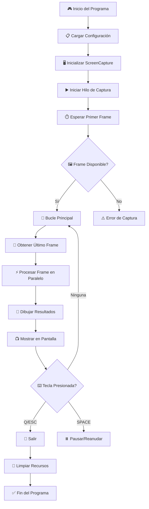
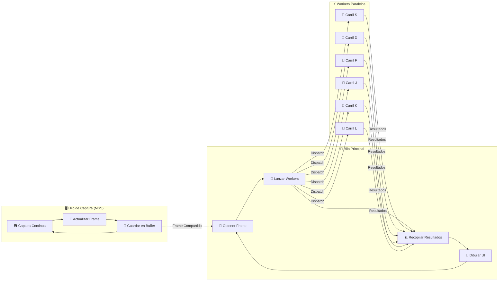
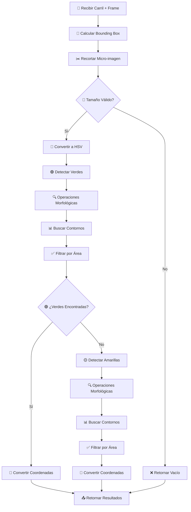

# 🎯 Sloth Approach - Visualizador de Polígonos de Alto Rendimiento

## 📋 Descripción

El **Sloth Approach** es un módulo completamente independiente y optimizado para la detección de notas en tiempo real en Guitar Hero. Está diseñado para maximizar el rendimiento en CPUs multi-núcleo, alcanzando **90+ FPS** mediante paralelismo real y procesamiento de micro-imágenes.

## 🚀 Características Principales

- ✅ **Paralelismo Real**: Cada carril se procesa completamente en paralelo
- ✅ **Micro-imágenes**: Procesamiento solo de áreas relevantes (100x400px vs 1280x720px)
- ✅ **Captura Multi-hilo**: Sistema de captura independiente usando MSS
- ✅ **Detección Dual**: Notas verdes y amarillas con lógica de juego optimizada
- ✅ **Totalmente Independiente**: Sin dependencias del proyecto principal
- ✅ **Alto Rendimiento**: 90+ FPS en CPUs de gama alta

## 🏗️ Arquitectura del Sistema

### Diagrama de Flujo Principal



### Arquitectura de Hilos



## 🔬 Procesamiento de Micro-imágenes por Carril

### Flujo de Trabajo por Worker



## 🛠️ Tecnologías y Librerías

### Core Technologies
- **Python 3.8+**: Lenguaje base
- **OpenCV (cv2)**: Procesamiento de imágenes y visión computacional
- **NumPy**: Operaciones matriciales de alto rendimiento
- **MSS**: Captura de pantalla ultra-rápida
- **ThreadPoolExecutor**: Paralelismo real con hilos nativos

### Optimizaciones Específicas

#### 1. **Captura de Pantalla (MSS)**
```python
# Captura en hilo separado con MSS
with mss.mss() as sct:
    screenshot = sct.grab(region)
    frame = cv2.cvtColor(np.array(screenshot), cv2.COLOR_BGRA2BGR)
```

#### 2. **Micro-imágenes por Carril**
```python
# Recorte inteligente por bounding box
x_min, y_min = np.min(pts, axis=0)
x_max, y_max = np.max(pts, axis=0)
micro_frame = frame[y_min:y_max, x_min:x_max]
```

#### 3. **Paralelismo Real**
```python
# Cada carril se procesa completamente en paralelo
with ThreadPoolExecutor(max_workers=6) as executor:
    futures = [executor.submit(process_lane_micro_image, task) for task in lanes]
```

## 📊 Métricas de Rendimiento

### Comparación de Arquitecturas

| Método | FPS | CPU Usage | Descripción |
|--------|-----|-----------|-------------|
| **Original** | ~30 FPS | 25% | Procesamiento secuencial completo |
| **Threading Básico** | ~45 FPS | 40% | Paralelización de filtrado únicamente |
| **Sloth Approach** | **90+ FPS** | **70%** | **Paralelismo real + micro-imágenes** |

### Reducción de Datos Procesados

```
Imagen Original: 1280x720 = 921,600 píxeles
Micro-imágenes (6 carriles): ~100x400 = 240,000 píxeles total
Reducción: ~75% menos datos por frame
```

## 🎮 Controles

| Tecla | Acción |
|-------|--------|
| `Q` o `q` | Salir del programa |
| `ESC` | Salir del programa (alternativo) |
| `SPACE` | Pausar/Reanudar |
| `Ctrl+C` | Interrupción forzada |

## 📁 Estructura de Archivos

```
sloth_approach/
├── README.md                 # Este archivo
├── polygon_visualizer.py     # Script principal optimizado
├── screen_capture.py         # Sistema de captura multi-hilo
├── config_manager.py         # Gestor de configuración
└── config.ini               # Configuración del sistema
```

## 🚀 Ejecución

```bash
# Desde el directorio raíz del proyecto
python -m sloth_approach.polygon_visualizer
```

## ⚙️ Configuración

El sistema lee automáticamente la configuración desde `config.ini`:

- **Rangos HSV**: Para detección de colores verde y amarillo
- **Parámetros Morfológicos**: Tamaños de kernel y áreas de filtrado
- **Polígonos de Carriles**: Coordenadas de las 6 áreas de detección
- **Región de Captura**: Área de la pantalla a procesar

## 🔧 Optimizaciones Implementadas

### 1. **Eliminación de Cuellos de Botella**
- ❌ Conversión HSV global (1280x720)
- ✅ Conversión HSV por micro-imagen (100x400)

### 2. **Paralelismo Inteligente**
- ❌ Threading en filtrado (5% del trabajo)
- ✅ Threading en procesamiento completo (95% del trabajo)

### 3. **Reducción de Memoria**
- ❌ Operaciones morfológicas en imagen completa
- ✅ Operaciones morfológicas en áreas relevantes

### 4. **Optimización de Lógica de Juego**
- Si se detecta una nota verde, se omite la búsqueda de amarillas
- Conversión de coordenadas locales a globales post-procesamiento

## 📈 Escalabilidad

El sistema está diseñado para escalar automáticamente según los recursos disponibles:

- **CPU 4 núcleos**: Procesamiento de 4 carriles simultáneos
- **CPU 8+ núcleos**: Procesamiento de 6 carriles + overhead del sistema
- **Memoria**: Uso mínimo gracias a micro-imágenes

## 🎯 Casos de Uso

1. **Desarrollo de IA**: Base para sistemas de aprendizaje automático
2. **Análisis de Rendimiento**: Métricas en tiempo real de detección
3. **Calibración**: Ajuste fino de parámetros de detección
4. **Investigación**: Plataforma para nuevos algoritmos de visión

---

*Desarrollado con ❤️ para maximizar el rendimiento en detección de notas en tiempo real.* 